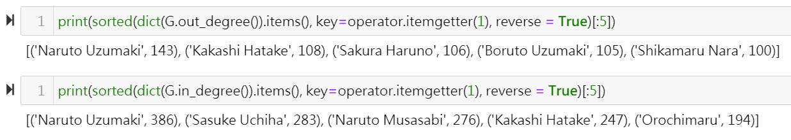
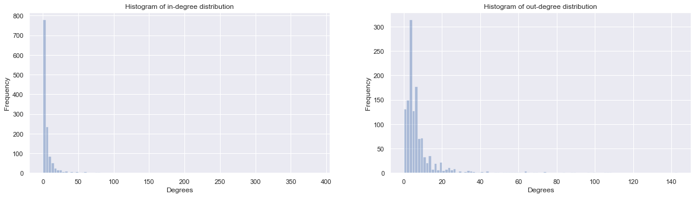
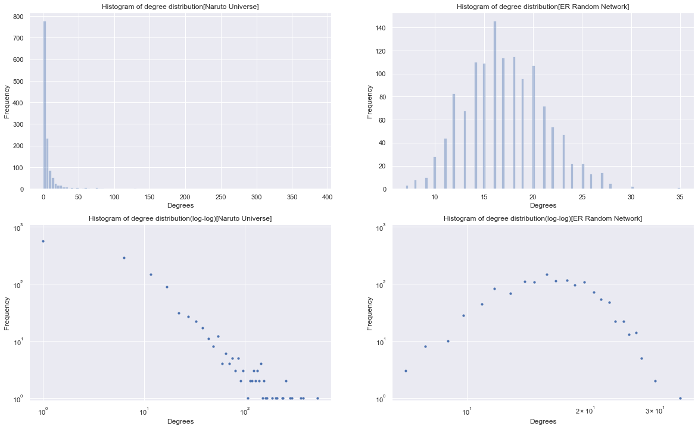
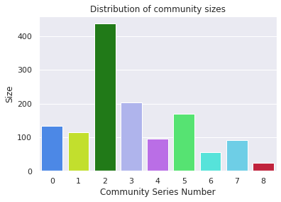
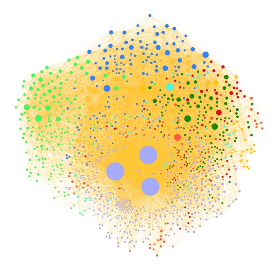

Note: this page is just used to show our analysis work for Naruto World based on the skills we learned from the Social Network class.

# Story Origin

Ninja is a well-known ancient profession in Japan. Their work includes protecting important people, sneaking into enemy camps to collect intelligence, performing secret missions, assassination activities, etc. This ancient profession in Japan is very similar to the military officer Jin Yiwei of the official intelligence agency of the Ming Dynasty in China, except that they have been given a more legendary color after the dramatic interpretation of artistic works. One of the most popular comics related to this topic is called <i>Naruto</i>, which tells a passionate, warm and inspirational ninja story. Therefore, our interest is to analyze the ninja world described in this comic by means of complex networks and natural language processing. Not much to say, let us walk into the world of Naruto together.

# Introduction

    
    

    This classic comic is developed around the fetters of the two protagonists <b>Naruto Uzumaki</b> and <b>Sasuke Uchiha</b>. The specific storyline will not be introduced in detail here, and interested friends can search by themselves. <i>Naruto</i> is a comic with a grand world, including a large number of characters and related concepts, which is very suitable for network analysis. Therefore, by constructing a complex network and performing basic network analysis, we can understand the number of characters, the out-degree, the in-degree, the nature of the network, and the network diagram based on the overall character connections. In this work, most ninja characters have corresponding ninja villages, clans and ninja levels. These different attributes divide the ninjas into different groups, and also imply a certain relationship between ninjas. Our research interest also includes whether the communities divided according to these attributes are consistent with the communities solved by the algorithm based on node connections. Apart from these goals, we also tried to find the wordcloud, calculate centrality and implement sentiment analysis, etc.   
    

# Network Analysis

Our datasets are extracted from the Fandom wikipages by using the API provided by this website and some libraries such as JSON, urllib, and BeautifulSoup, etc. The first dataset is the text content of every character webpage shown in the comic. The second data set is the XXX. For the first dataset, we crawled the text length, affiliation and clan in each page as the attributes for the node. The network edges are generated according to the superlinks of corresponding node pages. After constructing the network, it is easy to obtain the number of nodes and edges by calling the built-in methods of NetworkX. The result shows there are <b>1293</b> nodes and <b>11055</b> edges and note that the isolated nodes that there is no connection between that node and others has been removed already.

## Degree Analysis

    

        The degree of a node in the network is the number of adjacent nodes that the i-th node has, which is the simplest but most important feature. The greater the degree, the more important the node is to some extent. For directed networks, degrees are divided into two categories: out-degree and in-degree. Out-degree refers to the number of edges from current node to other node. In-degree refers to the number of edges from other node to current node. 
        Once the network generated successfully, the degree analysis will not be complex since the third-party library <i>NextwrokX</i> provides us with a lot of methods. From the figure below, you can see the top 5 nodes in terms of the number of out-degree and in-degree. The result is basically consistent with our expected result. They are indeed the most important characters in this comic. However, the appearance of "Naruto Musasabi" is out of our expectation that this character occupies the third place in the in-degree rank list. We found that this character is a fictional character from a novel written by a real character Jiraiya and this character is protagonist Naruto Uzumaki's namesake, which makes it own high in-degree. At the same time, the in-degree value greater than the out-degree value can also be explained, because most small characters will cite several important characters, but they are rarely cited by other characters, which leads to a very large in-degree of important characters. 
    

    
    

        Here for both distribution, the bins are 100. We used 'Frequency' as y-label here, according to the given example in lecture 4.
    

    

        For in-degree distribution, most of the values are distributed between 0 and 50(more exactly, 0 to 20). There are limited nodes with extremely high in-degrees in the network, which means that the tail of this power-law distribution(long-tail distribution) will be pretty long. From the figure of out-degree distribution, the conclusion can be obtained that unlike the case of in-degrees, many nodes own non-zero out-degree values. Besides, the variance of out-degree frequency is considerable smaller than that of in-degree one and there aren't many outliers.
    

    
    

    Clearly, for Naruto degree distribution, it looks like power-law distribution. Most nodes have links between 0 and 50 and a few of them have a considerable number of links. The nodes with high degree value are those who have high in-degrees. These protagonists can be considered as hubs in the network.
    For ER random network, it obeys binominal distribution and can be thought as Poisson Distribution roughly because we have a large number of nodes. Most degrees are distributed between 10 and 25.
    

    

## Centrality Analysis

    

    Centrality analysis can help us to find the most important node in the network and in our analysis, three different methods for calculating the centrality are used; they are <b>degree centrality</b>，<b>betweenness centrality</b> and <b>eigenvector centrality</b> respectively. The results are shown in the figure below.
    

    
    

    The leftest figure is obtained by using the degree centrality, the middle one shows the centrality based on the betweenness centrality and the result of egienvector centrality can be found in the rightest figure. From these figures, it is obvious that the top 3 characters in terms of centrality are Naruto Uzumaki, Kakashi Hatake and Sasuke Uchiha according to all 3 methods, which fits our expectations perfectly. However, the fourth and fifth characters found are a bit different. One of the most important villains named Orochimaru and absolute protagonist's son Boruto Uzumaki show up in two results and meanwhile the heroine Sakura Haruno and another important villain Yakushi appear once each. This difference comes from the solving logic of different algorithm and more details are given in our explainer notebook. Overall, the results are reasonable because they are all key characters whose story runs through the whole work.       
    

## Community Analysis

    

    Here, you can find all 9 communities givne by <i>Louvain Method</i> in the communities figure. The x-axis represents the sequence number of each community and the y-axis represents the number of nodes for that community.  
    

    
    <table style="width:30%; height: 300px; margin-left:20px;">
        <tr>
            <th></th>
            <th><b>Community</b></th>
        </tr>
        <tr>
            <td>0</td>
            <td>Kabuto Yakushi & Might Guy & Kurama</td>
        </tr>
        <tr>
            <td>1</td>
            <td>Tsunade & Jiraiya & Nagato</td>
        </tr>
        <tr>
            <td>2</td>
            <td>Naruto Uzumaki & Kakashi Hatake & Sasuke Uchiha</td>
        </tr>
        <tr>
            <td>3</td>
            <td>Sakura Haruno & Gaara & Shikamaru Nara</td>
        </tr>
        <tr>
            <td>4</td>
            <td>Sai & Kankurō & Sasori</td>
        </tr>
        <tr>
            <td>5</td>
            <td>Boruto Uzumaki & Mitsuki & Sarada Uchiha</td>
        </tr>
        <tr>
            <td>6</td>
            <td>Orochimaru & Kimimaro & Guren</td>
        </tr>
        <tr>
            <td>7</td>
            <td>Itachi Uchiha & Danzō Shimura & Minato Namikaze</td>
        </tr>
        <tr>
            <td>8</td>
            <td>Shabadaba & Haido & Hikaru Tsuki</td>
        </tr>
    </table>

## Network Overview

    

    The overall network of Naruto World is shown in the figure below. As shown in the figure, those nodes whose size is obviously larger than others are critical protagonists in the network. They have higher degrees. Different node is grouped in a different community with different colors. The connections(links) among these nodes are drawn in shallow yellow.
    

    

# Text Analysis

# Download our dataset to play around & See our explainer notebook for more details 
Click here: you can find our data set. <a href="https://www.google.com">Data Set</a>
 
Click here: you can find our explainer notebook. 